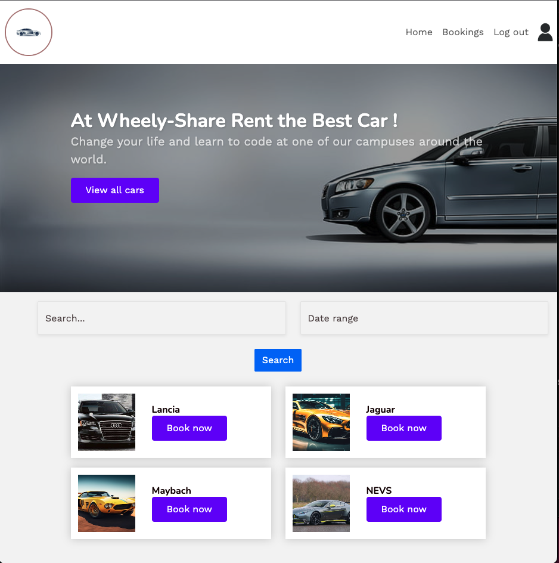
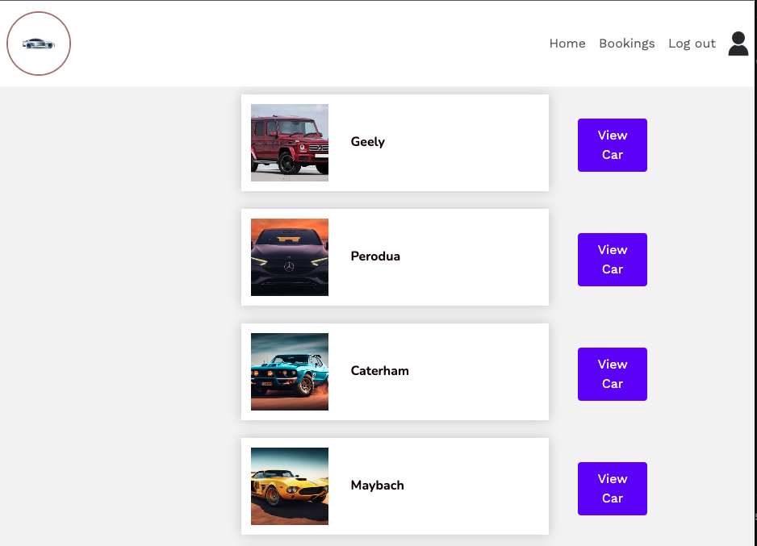
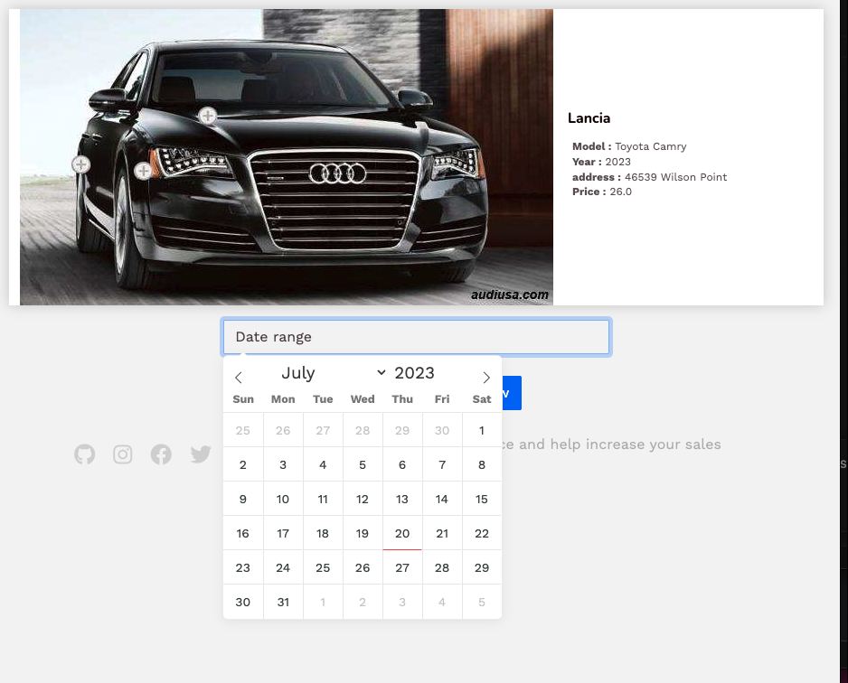
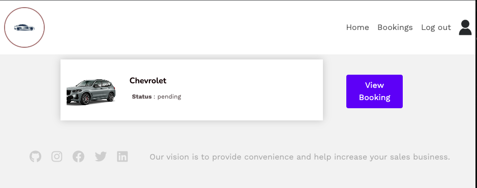

# Rails Rent Cars

## Base de données

Une voiture n'est pas valide :

- Si elle n'a pas de marque.
- Si elle n'a pas de modèle.
- Si elle n'a pas d'adresse.
- Si son prix journalier est inférieur ou égal à zéro.

Une réservation n'est pas valide :

- Si elle n'a pas de date de début.
- Si elle n'a pas de date de fin.

La suppression d'un utilisateur doit entraîner la suppression de ses voitures et de ses réservations. La suppression d'une voiture doit entraîner la suppression de ses réservations.

## Interface utilisateur

- En tant qu'utilisateur, je peux accéder à la page d'accueil.
- En tant qu'utilisateur, je peux voir la liste de toutes les voitures.
- En tant qu'utilisateur, je peux accéder aux détails d'une voiture.
- En tant qu'utilisateur, je peux réserver une voiture.

## Home page

## Car list

## Booking a Car

## Booking

